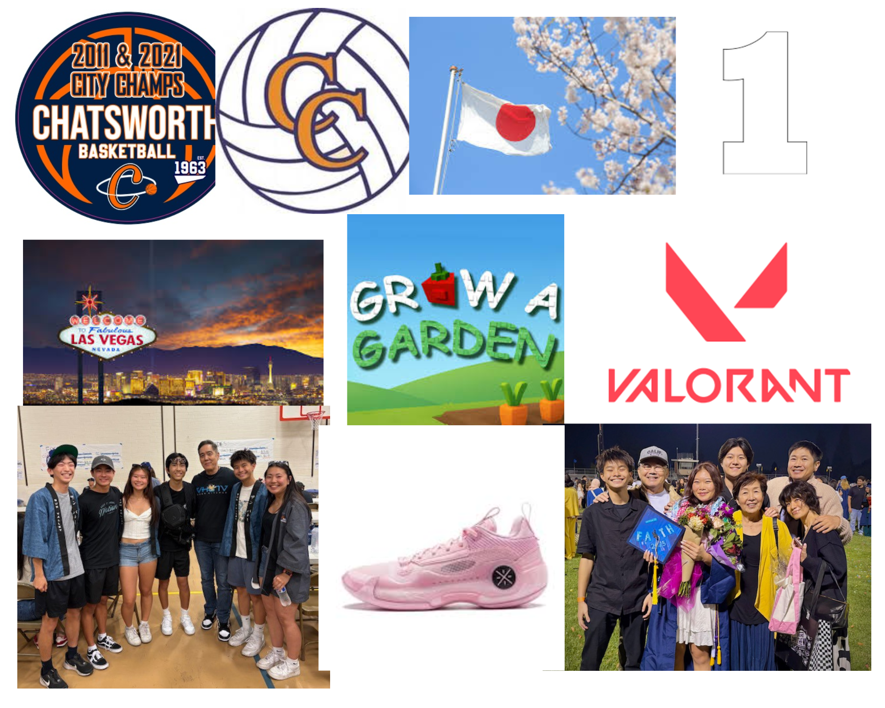

# Me-in-Markdown

#  Introduction
Hello my name is Mikey Murata, and I am 15 years old. I am a student at Chatsworth Charter High School and I am in the 10th grade. I play on the basketball team at our school as well as the volleyball team. I enjoy playing both of these sports along with other things like playing video games on my PC at home. I have two siblings, an older brother and an older sister, both of which attended Chatsworth too.I struggled last year in Computer Science Principles but I am hoping to be able to get an A in this class this year.

In my life I have played many different sports at different times and some sports at the same time. I grew up with siblings who played sports whcih kind of lead me too start up picking up sports as well. In kindergarten I started with playing soccer for a year, then made my way over to basketball which I have been playing for most of my life. I picked up volleyball only last year since the boys volleyball season was during the bsketball offseason. Those are some sports I hhave played over the course of my life.

Over the summer I didn't do as much as I was hoping for but I still had some eventful days. I had a trip to Las vegas for one of my basketball tournaments. Me and my family stayed at Red Rock hotel and stayed for 4 days total. I ended up winning my tournament and had a fun stay. 

# Playlist

# Collage
